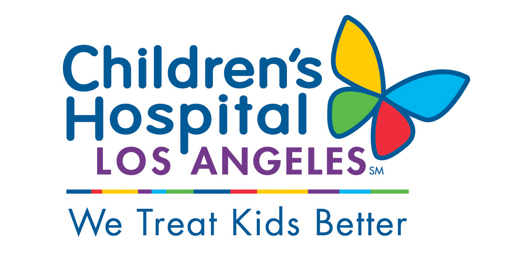

## Patient Mortality Prediction Using LSTM

This repository presents a deep learning project for predicting patient mortality using Long Short-Term Memory (LSTM) networks. The project aims to predict mortality based on medical encounter data from the pediatric intensive care unit (PICU). The data preprocessing, model construction, training, evaluation, and visualization steps are outlined below.

### Table of Contents:

1. **Data Preparation and Exploration**
   1.1 [Set Up the Environment](#01_setup)
   1.2 [Load the Data with *pandas*](#01_pandas)
   1.3 [Visualize the Data](#01_explore)
      1.3.1 [Example: View Data from a Single Encounter](#01_single)
      1.3.2 [Exercise: Observation Count Histogram](#01_ex_nobs)
      1.3.3 [Exercise: Length of PICU Stay Histogram](#01_ex_time)
   1.4 [Save a *pandas* DataFrame](#01_save)
   
2. **Data Preprocessing**
   2.1 [Normalize the Data](#02_normalize)
   2.2 [Fill Data Gaps](#02_gaps)
   2.3 [Pad Variable Length Sequences](#02_pad)
      2.3.1 [Exercise: Padded Variable over all Patient Encounters](#02_ex_pad)
   2.4 [Save a *NumPy* Array](#02_save)
   [Solutions](#02_solutions)
   
3. **LSTM Model Construction and Training**
   3.1 [Design the LSTM Network Architecture](#03_construct)
      3.1.1 [Recurrent Neural Network Models](#03_rnn)
      3.1.2 [Construct an LSTM Network with *Keras*](#03_lstm)
      3.1.3 [Model Architecture Decisions](#03_decisions)
   3.2 [Train the Model](#03_train)
   3.3 [Evaluate the Model Using Validation Data](#03_evaluate)
   3.4 [Visualize the Results](#03_visualize)
   3.5 [Compare the Baseline to PRISM3 and PIM2](#03_compare)
   3.6 [Conclusion](#03_conclusion)

This project aims to predict patient outcomes in a medical setting using LSTM networks. The code includes data preprocessing steps, LSTM model construction, training, evaluation, and result visualization. Feel free to navigate through the sections to understand the workflow and delve into specific aspects of the project. Happy exploring! 🏥🔍